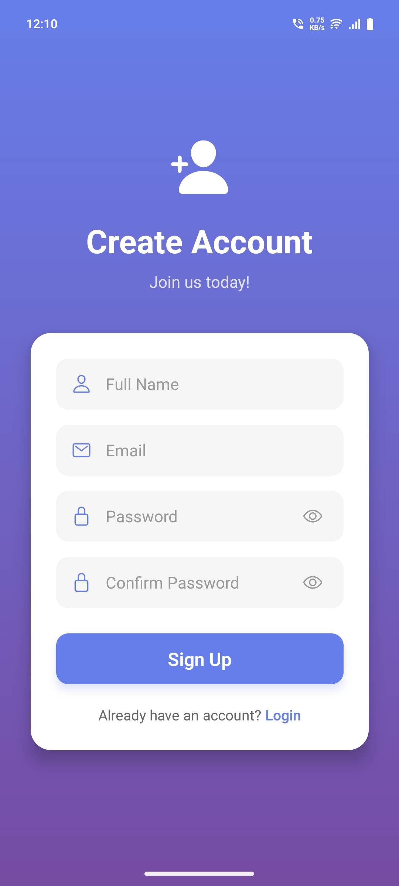
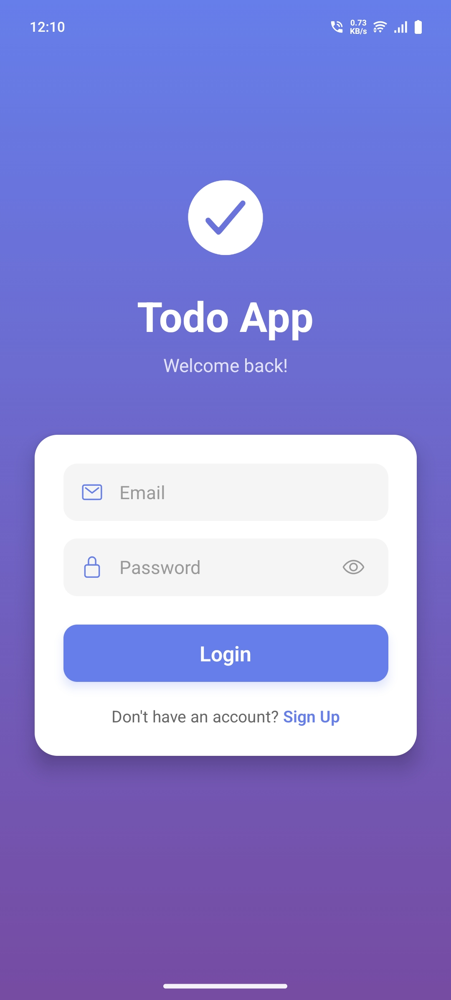
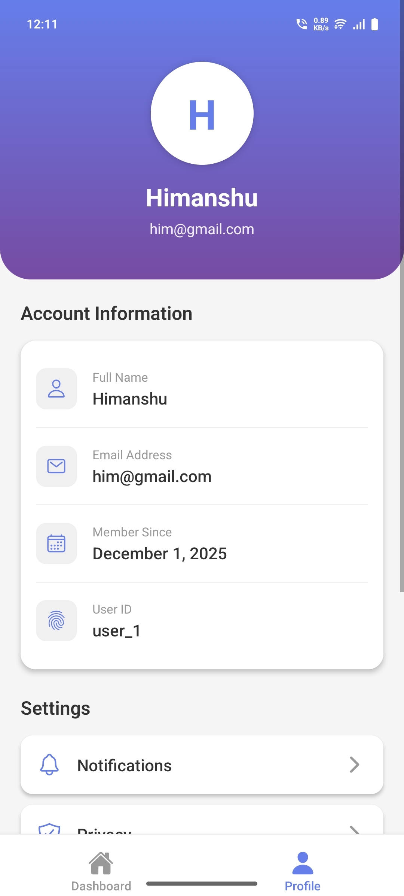
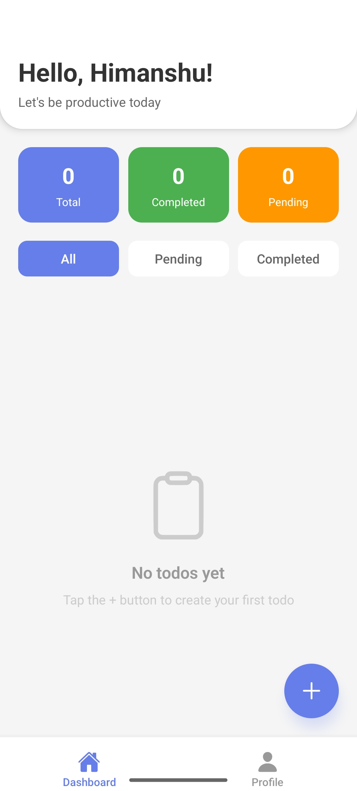
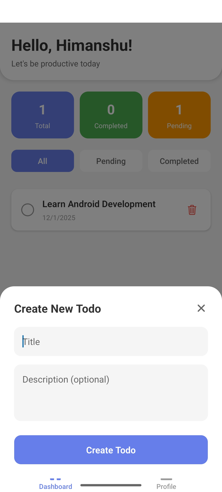
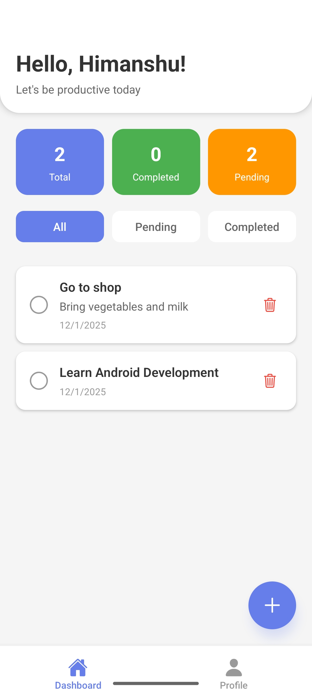

# Todo Mobile Application

A full-stack todo application built with React Native (Expo) and FastAPI, featuring authentication, API integration, and a beautiful UI.

## Screenshots

<div style="display: flex; gap: 10px; justify-content: center">
  
  
  
</div>
<br>
<div style="display: flex; gap: 10px; justify-content: center">
  
  
  
</div>

## 🚀 Features

### Frontend (React Native + Expo)

-   **Authentication**: Login/Signup with JWT tokens
-   **Dashboard**: Create, view, update, and delete todos
-   **Todo Management**: Mark todos as complete/pending
-   **Filtering**: Filter todos by status (All, Pending, Completed)
-   **Statistics**: Real-time stats showing total, completed, and pending todos
-   **Profile**: View user profile details
-   **Beautiful UI**: Modern gradient design with smooth animations

### Backend (FastAPI + Python)

-   **JWT Authentication**: Secure token-based authentication
-   **RESTful API**: Clean and well-documented endpoints
-   **Password Hashing**: Secure password storage with bcrypt
-   **Data Validation**: Pydantic models for request/response validation
-   **CORS Support**: Cross-origin resource sharing enabled
-   **Statistics Endpoint**: Get todo completion metrics

## 📁 Project Structure

```
todo-mobile-app/
├── backend/
│   ├── main.py                 # FastAPI application
│   └── requirements.txt        # Python dependencies
│
├── app/
│   ├── (tabs)/
│   │   ├── _layout.js         # Tab navigation
│   │   ├── index.js           # Dashboard screen
│   │   └── profile.js         # Profile screen
│   ├── _layout.js             # Root layout with auth routing
│   ├── login.js               # Login screen
│   └── signup.js              # Signup screen
│
├── src/
│   ├── context/
│   │   └── AuthContext.js     # Authentication context
│   └── services/
│       └── api.js             # API service layer
│
├── app.json                   # Expo configuration
└── package.json              # Node dependencies
```

## 🛠️ Setup Instructions

### Backend Setup

1. **Navigate to backend directory**:

```bash
cd backend
```

2. **Create a virtual environment** (recommended):

```bash
python -m venv venv

# Activate virtual environment
# On Windows:
venv\Scripts\activate
# On macOS/Linux:
source venv/bin/activate
```

3. **Install dependencies**:

```bash
pip install -r requirements.txt
```

4. **Run the FastAPI server**:

```bash
python main.py
```

The API will be available at `http://localhost:8000`

5. **View API documentation**:

-   Swagger UI: http://localhost:8000/docs
-   ReDoc: http://localhost:8000/redoc

### Frontend Setup

1. **Navigate to project root**:

```bash
cd ..
```

2. **Install dependencies**:

```bash
npm install
```

3. **Configure API URL**:

Open `src/services/api.js` and update the `API_BASE_URL`:

```javascript
// For iOS Simulator
const API_BASE_URL = "http://localhost:8000";

// For Android Emulator
const API_BASE_URL = "http://10.0.2.2:8000";

// For Physical Device (use your computer's local IP)
const API_BASE_URL = "http://192.168.1.100:8000";
```

**To find your local IP**:

-   **Windows**: `ipconfig` (look for IPv4 Address)
-   **macOS/Linux**: `ifconfig` or `ip addr show`

4. **Start Expo**:

```bash
npm start
```

5. **Run on your device**:

-   **iOS Simulator**: Press `i` in terminal
-   **Android Emulator**: Press `a` in terminal
-   **Physical Device**: Scan QR code with Expo Go app

## 📱 App Screens

### 1. Login Screen

-   Email and password authentication
-   Password visibility toggle
-   Navigation to signup
-   Beautiful gradient design

### 2. Signup Screen

-   Name, email, and password registration
-   Password confirmation
-   Validation for all fields
-   Navigation to login

### 3. Dashboard

-   **Statistics Cards**: Total, Completed, and Pending todos
-   **Filter Tabs**: View all, pending, or completed todos
-   **Todo List**: Scrollable list with pull-to-refresh
-   **Create Todo**: Floating action button opens modal
-   **Todo Actions**:
    -   Tap checkbox to toggle completion
    -   Tap trash icon to delete
-   **Empty State**: Friendly message when no todos exist

### 4. Profile Screen

-   User information display
-   Account details (name, email, join date, user ID)
-   Settings options (UI only)
-   Logout functionality

## 🔌 API Endpoints

### Authentication

-   `POST /api/auth/signup` - Register new user
-   `POST /api/auth/login` - Login user
-   `GET /api/user/profile` - Get user profile (protected)

### Todos

-   `GET /api/todos` - Get all todos (with optional status filter)
-   `POST /api/todos` - Create new todo
-   `GET /api/todos/{id}` - Get specific todo
-   `PUT /api/todos/{id}` - Update todo
-   `DELETE /api/todos/{id}` - Delete todo
-   `GET /api/todos/stats/summary` - Get todo statistics

## 🎨 Design Highlights

-   **Color Scheme**: Purple gradient (#667eea to #764ba2)
-   **Typography**: Clean, modern fonts with proper hierarchy
-   **Icons**: Ionicons for consistent iconography
-   **Animations**: Smooth transitions and loading states
-   **Responsive**: Works on all screen sizes
-   **Accessibility**: Proper contrast ratios and touch targets

## 🔐 Security Features

-   **Password Hashing**: Bcrypt with salt rounds
-   **JWT Tokens**: Secure authentication tokens
-   **Token Storage**: AsyncStorage for persistent login
-   **Protected Routes**: Authentication required for app screens
-   **Input Validation**: Both frontend and backend validation

## 🧪 Testing the App

### Test Users

Create test accounts through the signup screen. Example:

-   **Name**: John Doe
-   **Email**: john@example.com
-   **Password**: password123

### Test Scenarios

1. **Signup Flow**: Create new account → Auto login → Redirect to dashboard
2. **Login Flow**: Login with existing account → Redirect to dashboard
3. **Create Todo**: Click + button → Fill form → Submit
4. **Complete Todo**: Tap checkbox → Todo marked as completed
5. **Filter Todos**: Use filter tabs to view different todo lists
6. **Delete Todo**: Tap trash icon → Confirm deletion
7. **Logout**: Go to profile → Tap logout → Redirect to login

## 📦 Dependencies

### Backend

-   `fastapi` - Modern web framework
-   `uvicorn` - ASGI server
-   `pydantic` - Data validation
-   `bcrypt` - Password hashing
-   `pyjwt` - JWT encoding/decoding

### Frontend

-   `expo` - React Native framework
-   `expo-router` - File-based routing
-   `axios` - HTTP client
-   `@react-native-async-storage/async-storage` - Local storage
-   `expo-linear-gradient` - Gradient components
-   `@expo/vector-icons` - Icon library

## 🚀 Production Deployment

### Backend

1. **Use a real database** (PostgreSQL, MongoDB, etc.)
2. **Set environment variables**:

```bash
export SECRET_KEY="your-secure-secret-key"
export DATABASE_URL="your-database-url"
```

3. **Deploy to**: Railway, Heroku, AWS, or DigitalOcean
4. **Enable HTTPS**

### Frontend

1. **Build for production**:

```bash
eas build --platform android
eas build --platform ios
```

2. **Update API URL** to production backend
3. **Submit to app stores**

## 🐛 Troubleshooting

### Common Issues

1. **Cannot connect to backend**:

    - Check API_BASE_URL in `api.js`
    - Ensure backend is running
    - Check firewall settings
    - Use correct IP for physical devices

2. **Expo won't start**:

    - Clear cache: `npm start -- --clear`
    - Reinstall dependencies: `rm -rf node_modules && npm install`

3. **Authentication not working**:

    - Check network connectivity
    - Verify backend is accessible
    - Check browser console/network tab

4. **Todos not loading**:
    - Check authentication token
    - Verify API endpoints
    - Check backend logs

## 👨‍💻 Development

Built with ❤️ using React Native, Expo, and FastAPI

**Happy Coding! 🎉**
